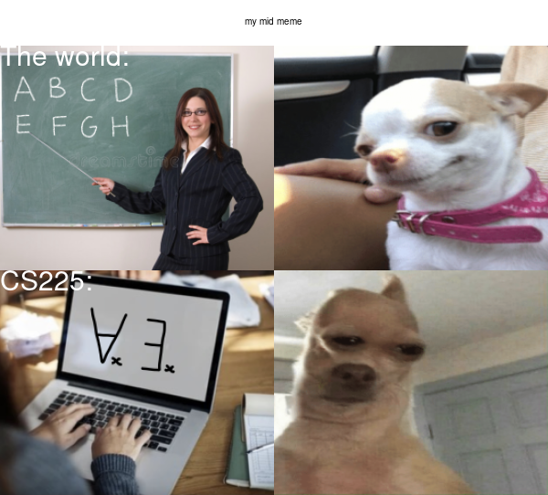

# Hello there!

### Welcome to my test website


## About Me
* I am a data science student studying at the ***University of Auckland***
* I like orangutans 🦧 

## Reasons Behind My Meme
1. CS225 is confusing
2. Logic is confusing
3. Math is confusing
4. I like dogs 🐕 



*I haved adapted the original four frame meme format to easily display my creation.*

[R](https://www.r-project.org) code I used to make my meme:
```r
library(magick)

happy_image <- image_read("https://i.imgur.com/XiActUT.jpeg") %>%
  image_scale(300) %>%
  image_crop("300x300+24") %>%
  image_scale(300)
  
abc <- image_read("https://i.imgur.com/ei8vPNQ.jpeg") %>%
  image_scale(300) %>%
  image_crop("300x300+20") %>%
  image_scale(300) %>%
  image_annotate(text = "The world:", color = "white", size = 30)
  
cs225 <- image_read("https://i.imgur.com/gHE7ygj.jpeg") %>%
  image_scale(300) %>%
  image_crop("300x300+33") %>%
  image_scale(300) %>%
  image_annotate(text = "CS225:", color = "white", size = 30)
  
confused_image <- image_read("https://i.imgur.com/gDFqJEw.jpeg") %>%
  image_scale(300) %>%
  image_crop("300x300+24") %>%
  image_scale(300)
  
title <- image_blank(width = 600, height = 50, color = "#ffffff") %>%
  image_annotate(text = "my mid meme", gravity = "center")

top <- c(abc, happy_image)
tops <- image_append(top)

bottom <- c(cs225, confused_image)
bottoms <- image_append(bottom)

whole <- c(title, tops, bottoms)
meme <- image_append(whole, stack = T)

image_write(meme, "my_meme.png")
```
